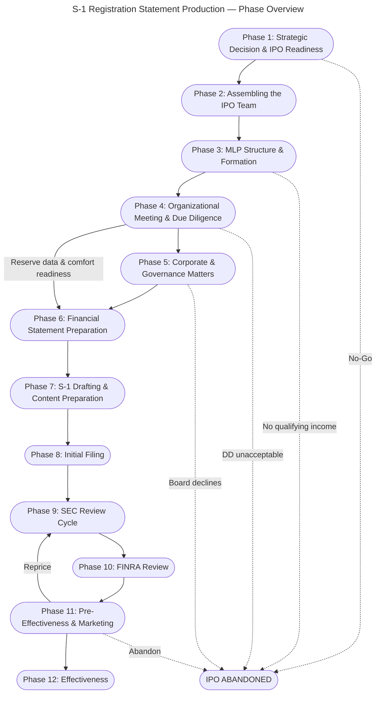

# Cover Memo — S-1 Registration Statement Production Flowchart

**Deliverable Package:** MNR S-1 Production Flowchart & RACI Matrix (vT3)
**Precedent Transaction:** Mach Natural Resources LP (CIK 0001980088)
**Date:** February 2026
**Authors:** Ezequiel Padilla (VDR Captain), Claude Opus 4.6 (LLM Co-Producer)

---

## 1. Transaction & Regulatory Context

This deliverable package maps the complete production process for an S-1 registration statement filed by an oil and gas Master Limited Partnership conducting an initial public offering. The precedent transaction is Mach Natural Resources LP, which filed its initial S-1 on September 22, 2023, submitted three S-1/A amendments (September 29, October 5, and October 16, 2023), and was declared effective on October 24, 2023 — a 32-day registration period from initial filing to effectiveness. The regulatory framework governing this process includes Securities Act Section 5 (registration requirements), Regulation S-K (non-financial disclosure), Regulation S-X (financial statement requirements), PCAOB auditing standards, FINRA Rule 5110 (underwriting compensation review), IRC §7704 (publicly traded partnership qualification), and SEC Regulation S-K Items 1200/1202 (oil and gas reserve disclosure). Mach Natural Resources was selected as the precedent because it represents a recent, complete MLP IPO with a full amendment history, multiple SEC comment-and-response cycles, and involvement of major law firms and auditors — providing a representative template for MLP S-1 production workflows. This flowchart assumes the Virtual Data Room is fully populated before S-1 drafting begins; the phase sequence reflects this input-first workflow assumption.

## 2. Strategic Rationale

The S-1 registration statement for an oil and gas MLP IPO was selected as the first LLM capability mapping target for four reasons. First, the economic value per transaction is high: a single MLP IPO generates $3–8 million in legal fees across counsel for issuer, underwriters, and tax advisors, creating significant margin opportunity for any automation that reduces production hours without sacrificing filing quality. Second, the document has substantial boilerplate density — many sections (Part II items, undertakings, exhibit indices, signature pages, front matter disclaimers) are structurally identical across transactions and vary only in entity-specific data points, making them strong candidates for LLM-tier production. Third, the production process operates within a structured regulatory framework (Reg S-K, Reg S-X, FINRA Rule 5110) that provides explicit, enumerable requirements for each section, enabling deterministic quality verification against known standards. Fourth, the workflow is scalable across adjacent transaction types: the 12-phase production structure applies with modification to corporate IPOs, direct listings, SPAC de-SPACings, and follow-on offerings — each sharing 60–80% of the same phase architecture with sector-specific variations in Phases 3, 6, and 7.

---

---

## 3. Evaluation Framing

The deliverable package consists of four validated artifacts: a Mermaid flowchart (129 nodes: 111 action, 12 decision, 6 milestone; 181 edges across 12 phases), a RACI matrix (111 action rows with R/A/C/I assignments across 8 roles), a step classification table (111 rows with LLM capability tier assignments), and this cover memo. The tier classifications serve as ground truth for LLM evaluation: the 25 LLM-tier steps (22.5%) are the primary test targets, representing nodes where a frontier LLM should produce filing-quality output given the specified inputs. The 44 Hybrid-tier steps (39.6%) are secondary targets, representing nodes where the LLM produces a substantial first draft but a human must make material substantive decisions. The production sequence in the flowchart maps directly to the testing sequence — each LLM-tier node is a discrete test case with defined inputs (from the RACI matrix's Consulted and Informed columns), a defined responsible role (the R column), and a defined output (the deliverable section column). Success for each test case means the LLM produces output that a senior securities attorney would accept with only minor, non-substantive edits. The 25 Human-tier steps (22.5%) and 17 External-tier steps (15.3%) are excluded from LLM testing — these require negotiation, physical action, regulatory judgment, or third-party professional work product that cannot be simulated.

## 4. Testing Questions

The following evaluation questions map directly to LLM-tier and Hybrid-tier nodes in the flowchart. Each question is answerable by running the corresponding node as a test case with VDR inputs.

**LLM-Tier Test Cases (primary targets):**

1. Can Claude determine filer status (EGC, SRC, LAF) by applying Securities Act revenue, float, and debt thresholds to provided financial data and produce a compliant filer status memo? *(Node: CompCounsel_DetermineFilerStatus)*

2. Can Claude compute Reg S-X Rule 3-12 staleness deadlines from a given fiscal year-end date and produce a filing calendar with update triggers? *(Node: CompCounsel_ProduceStalenessCalendar)*

3. Can Claude compile an exhibit index cross-referenced to S-K Item 601 categories from a list of executed exhibits? *(Node: CompCounsel_CompileExhibitIndex)*

4. Can Claude compute a filing fee table per SEC Rule 457 given offering amount, price range, and fee rate, and produce a formatted Exhibit 107? *(Node: CompCounsel_ProduceFeeTable)*

5. Can Claude populate all pricing blanks throughout an S-1 draft given a final price, unit count, and overallotment option, and verify internal consistency of populated fields? *(Node: CompCounsel_PopulatePricing)*

**Hybrid-Tier Test Cases (secondary targets — require human judgment on substantive decisions):**

6. Can Claude draft Item 1A risk factors from VDR source documents, organized by category with cross-references, where a senior attorney needs only to validate materiality judgments and prioritization? *(Node: CompCounsel_DraftRiskFactors)*

7. Can Claude structure and draft MD&A with period-over-period variance analysis from provided financials, where a senior attorney needs only to validate management's explanatory narrative and forward-looking statement framing? *(Node: CompCounsel_DraftMDA)*

8. Can Claude draft a Prospectus Summary from a completed S-1 draft, where a senior attorney needs only to validate emphasis, positioning, and materiality determinations? *(Node: CompCounsel_DraftSummary)*

9. Can Claude draft CORRESP response letters by parsing an SEC comment letter, categorizing issues, and proposing response language with redline prospectus edits, where a senior attorney needs only to validate response strategy? *(Node: CompCounsel_DraftCORRESP)*

10. Can Claude assemble a complete DRS package from drafted sections and exhibits, verify completeness against the S-K checklist, and produce EDGAR-formatted output, where a senior attorney needs only to authorize submission? *(Node: CompCounsel_AssembleDRS)*

---

**Deliverable Package Contents:**

| File | Description |
|------|-------------|
| `MNR_S1_Flowchart_Mermaid_vT3.md` | Mermaid flowchart (129 nodes, 181 edges, 12 phases) |
| `MNR_S1_Step_Classification_vT3.md` | Step classification table (111 action nodes, 4 tiers) |
| `MNR_S1_RACI_Matrix_vT3.xlsx` | RACI matrix workbook (7 sheets, 2 charts) |
| `MNR_S1_Phase_Overview_vT3.md` | Phase overview chart (12 phases, 1 loop-back, 5 kill paths) |
| `MNR_S1_Flowchart_Slide_vT3.pptx` | Summary slide (single 16:9 slide) |
| `MNR_S1_Cover_Memo_vT3.md` | This document |
