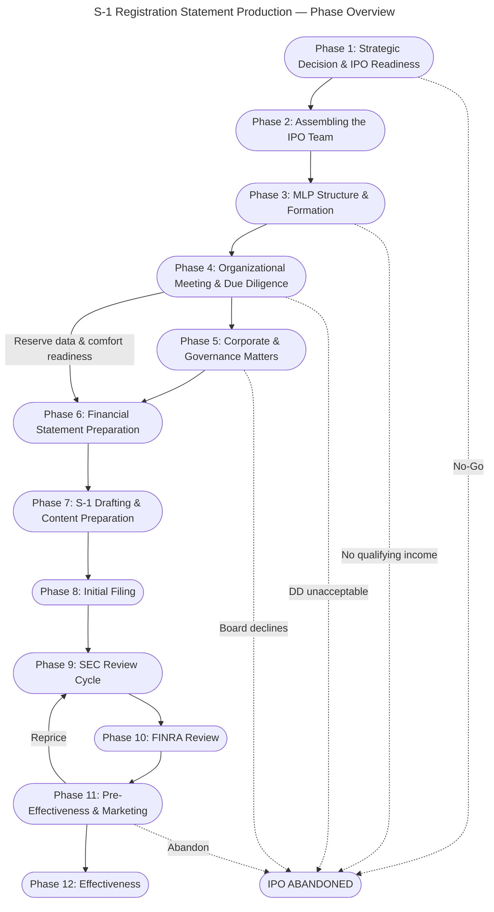

# MNR S-1 Phase Overview Chart — vT3

## Purpose
Simplified phase-level view of the S-1 production process. One node per phase, sequential arrows, labeled cross-phase connections derived from the vT3 flowchart (129 nodes, 181 edges).

## Cross-Phase Connections (derived from vT3 Mermaid code)
- **Sequential (P→P+1):** P1→P2→P3→P4→P5→P6→P7→P8→P9→P10→P11→P12
- **Forward skip:** P4→P6 (reserve data and comfort letter readiness feed financial statement preparation before Phase 5 completes)
- **Loop-back:** P11→P9 (repricing requires return to SEC review cycle)
- **Kill paths:** P1, P3, P4, P5, P11 → IPO Abandoned

